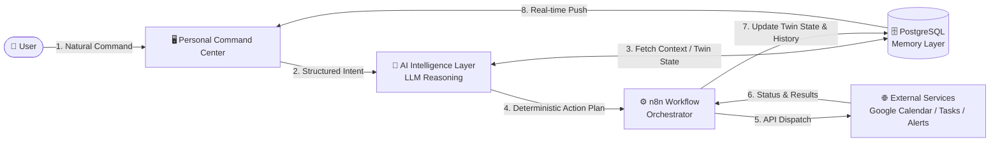

# OPHELIA — Your Intelligent Personal Automation Assistant

> **Reimagining repetitive planning, fragmented coordination, and task management through AI-driven reasoning and n8n workflow automation.**

[](#current-development-status)
[](LICENSE)
[](architecture/system-architecture.md)
[](architecture/dfd-level-0.md)

---

## 📌 Project Overview

**OPHELIA** is an AI-powered personal automation system engineered to eliminate repetitive human effort, synthesize information scattered across fragmented services, and execute multi-step actions autonomously. 

Instead of functioning as a conversational text chatbot or speech assistant, OPHELIA operates as an **AI Personal Command Center**. It combines large language model (LLM) reasoning with **n8n** as an industrial workflow orchestration engine, **PostgreSQL** as persistent memory, and a modern visual dashboard for situational awareness and approval gating.

```text
                               THE CORE CYCLE
               ┌─────────────────────────────────────────────┐
               ▼                                             │
      [ 1. UNDERSTAND ] → [ 2. REASON ] → [ 3. PLAN ] → [ 4. EXECUTE ]
             │                                               │
             └─────────────── [ 5. UPDATE ] ◄────────────────┘
```

The system is designed around a single guiding principle:
> **OPHELIA does not merely tell the user what to do — it understands the situation, plans the required steps, and executes them.**

---

## 🧩 The Problem: Task Fragmentation & Cognitive Load

Everyday knowledge workers and students waste hours performing repetitive, fragmented coordination:
* **Information Fragmentation:** Critical commitments are scattered across emails, multiple calendar apps, task trackers (Todoist, Notion), and direct messages.
* **Repetitive Decision Fatigue:** Users repeatedly evaluate deadlines, calculate free time slots, manually reschedule overlapping meetings, and set ad-hoc reminders.
* **Brittle Automation:** Existing automation tools (e.g., standard Zapier / IFTTT recipes) rely on rigid `IF-THIS-THEN-THAT` rules. They cannot extract implicit context, understand conflicting priorities, or adapt when a schedule shifts.

  👉 *Read the full problem breakdown in [docs/problem-statement.md](docs/problem-statement.md).*


---

## 💡 The Proposed Solution: Layered System Design

OPHELIA bridges the gap between high-level human intent and low-level API execution by cleanly separating responsibilities across five distinct architectural pillars:




---

## 🚀 Three Core Capabilities

### 1. AI Personal Dashboard (Visual Command Center)
OPHELIA replaces the traditional chatbot conversational box with a structured command center interface:
* **Active Attention Deck:** Surfaces urgent deadlines and scheduled commitments for today.
* **Proactive Intervention Cards:** Renders contextual suggestions with 1-click `[Review Plan]` and `[⚡ Execute via n8n]` controls.
* **High-Level Command Bar:** A single text input accepting high-level prompts (e.g., *"Organize my week"*).
* **Live Audit Log:** Displays real-time execution status and rollback options for completed automations.
* *Note: Voice recognition is deliberately not part of the current scope.*

### 2. Proactive Assistant (Continuous Background Monitoring)
OPHELIA does not sit idle waiting for commands. Once connected to external services, scheduled n8n workflows periodically monitor:
* Upcoming assignment deadlines lacking allocated study time.
* Direct schedule collisions between new meetings and focus blocks.
* Overloaded workdays exceeding human capacity limits.
* **Realistic Boundary:** OPHELIA monitors **only connected services** and surfaces recommendations with human-in-the-loop approvals rather than making unchecked life decisions.

### 3. One-Command Automation
Users provide a single high-level instruction:
> *“I have two assignments due Wednesday and an exam on Friday. Organize my week around my existing schedule.”*

OPHELIA deconstructs this prompt into atomic tasks, identifies available calendar blocks, verifies zero schedule overlap, and uses n8n to execute multiple API calls (creating calendar events, registering task milestones, and arming notification crons) in under 2 seconds.

👉 *Read the detailed walkthrough in [workflows/one-command-automation.md](workflows/one-command-automation.md).*

---

## 🏗️ System Architecture & Data Flow

OPHELIA’s architecture is structured to ensure that the LLM acts strictly as a reasoner, while n8n handles reliable, idempotent execution.

```text
┌── [ophelia-runtime-architecture] ──────────────────────────────────────────┐
│                                                                            │
│ USER INTERFACE (AI Personal Command Center)                                │
│ ├── Active Attention Feed        ← high-priority tasks, deadlines, alerts  │
│ ├── Proactive Action Cards       ← 1-click approval / execution triggers   │
│ ├── Natural-Language Command Box ← single high-level user instructions     │
│ └── Workflow Audit & Status Bar  ← live execution traces & rollback state  │
│         │                                                                  │
│         ▼  [REST / WebSocket JSON Payload]                                 │
│ AI INTELLIGENCE LAYER (LLM Brain)                                          │
│ ├── Intent Parser & Context Extractor     ← entity, deadline & goal mining │
│ ├── Dynamic Goal Planner                  ← multi-step task decomposition  │
│ ├── Prioritization & Trade-off Engine     ← resolves calendar collisions   │
│ └── Action Safety Classifier              ← low-risk auto vs. approval req │
│         │                                                                  │
│         ▼  [Structured n8n Webhook Trigger]                                │
│ AUTOMATION BACKBONE (n8n Engine)                                           │
│ ├── Webhook & Scheduled Cron Triggers     ← event-driven & periodic audits │
│ ├── Dynamic Workflow Dispatcher           ← routes plan to sub-workflows   │
│ ├── Conditional Branching & Error Handler ← retry logic, conflict rollback │
│ └── Approval Gate Node                    ← pauses sensitive actions       │
│         │                                                                  │
│    ┌────┴──────────────────────────┬─────────────────────────┐             │
│    ▼                               ▼                         ▼             │
│ MEMORY LAYER (PostgreSQL)   EXTERNAL SERVICES         CLIENT SYNC          │
│ ├── Tasks & Deadlines       ├── Google Calendar API   └── Live WebSocket   │
│ ├── Habits & Preferences    ├── Email / Gmail API         Push updates     │
│ ├── Schedule Twin State     ├── Todoist / Notion          to UI cards      │
│ └── Workflow Audit Trail    └── Weather & REST APIs                        │
│                                                                            │
└────────────────────────────────────────────────────────────────────────────┘
```

👉 *Explore the detailed system architecture in [docs/system-architecture.md](docs/system-architecture.md).*  
👉 *Review the Context DFD in [architecture/dfd-level-0.md](architecture/dfd-level-0.md) and the Process DFD in [architecture/dfd-level-1.md](architecture/dfd-level-1.md).*

---

## 📊 Feature Scope & Planned vs. Future Capabilities

| Feature Capability | Scope Level | Implementation Status | Technical Component |
| :--- | :--- | :--- | :--- |
| **AI Personal Command Center Dashboard** | MVP Scope | Planned / Blueprint | Next.js / React Web UI |
| **Natural Language Command Bar (Text)** | MVP Scope | Planned / Blueprint | Frontend + LLM Parser |
| **One-Command Multi-Action Execution** | MVP Scope | Planned / Blueprint | LLM Planner + n8n Webhooks |
| **Proactive Schedule Conflict Alerts** | MVP Scope | Planned / Blueprint | n8n 30-min Cron + UI Cards |
| **Google Calendar Integration** | MVP Scope | Planned / Blueprint | n8n Google Calendar Node |
| **Task Registry & Deadline Tracking** | MVP Scope | Planned / Blueprint | PostgreSQL + Todoist API |
| **Dual-Tier User Approval Controls** | MVP Scope | Planned / Blueprint | Human-in-the-Loop Node |
| **Audit Log & Rollback History** | MVP Scope | Planned / Blueprint | PostgreSQL `workflow_history` |
| **Specialized Modes (Study, Wellness)** | MVP Scope | Planned / Blueprint | Dynamic Prompt Schemas |
| **Canvas LMS / Educational Ingestion** | Future Scope | Roadmap Phase 2 | REST Ingestor Nodes |
| **Native Mobile Widgets (iOS/Android)** | Future Scope | Roadmap Phase 2 | React Native App |
| **Hands-Free Voice / Speech Recognition**| Future Scope | Roadmap Phase 3 | Whisper / Audio Pipeline |
| **Multi-Objective Constraint Solver** | Future Scope | Roadmap Phase 3 | Advanced Optimization Engine |

*Notice: This repository is a technical blueprint. Unfinished features are explicitly labeled as planned.*

---

## 🛠️ Technology Stack

| Layer | Proposed Technology | Justification |
| :--- | :--- | :--- |
| **Frontend UI** | **Next.js / React, Tailwind CSS** | Provides real-time reactivity, server-side rendering, and responsive card layouts. |
| **AI / Decision** | **OpenAI / Claude / Gemini API** | Advanced reasoning, zero-shot entity extraction, and structured JSON schema output. |
| **Orchestration**| **n8n (Self-Hosted / Cloud)** | Open, visual, modular workflow engine with built-in retry handling and API connectors. |
| **Database / Memory**| **PostgreSQL / Supabase** | Relational integrity for tasks, user routines, calendar cache, and execution logs. |
| **External APIs**| **Google Calendar API, Todoist API** | Industry-standard personal productivity endpoints for real-world execution. |

---

## 🧭 Repository Documentation Index

Judges and contributors can review our complete technical design documents:

* **Foundations:**
  * [Problem Statement](docs/problem-statement.md) — The pain of fragmented planning and rule-based limitations.
  * [Solution Overview](docs/solution-overview.md) — Comprehensive philosophy of the AI Command Center.
  * [Implementation Roadmap](docs/implementation-roadmap.md) — Seven-phase timeline from blueprint to deployment.
* **Architecture & Data Flow:**
  * [System Architecture](architecture/system-architecture.md) — Complete 5-layer technical breakdown.
  * [DFD Level 0 (Context Level)](architecture/dfd-level-0.md) — High-level system boundary and data flows.
  * [DFD Level 1 (Process Level)](architecture/dfd-level-1.md) — In-depth breakdown of processes P1 through P6 and Data Store D1.
* **Workflows & Automation:**
  * [One-Command Automation](workflows/one-command-automation.md) — Step-by-step trace of the flagship workflow.
  * [Proactive Assistant](workflows/proactive-assistant.md) — Background monitoring algorithms and approval gates.
  * [Task Management](workflows/task-management.md) — Task lifecycles, prioritization, and sync.
  * [Calendar Automation](workflows/calendar-automation.md) — Collision detection and slot finding.
  * [Workflow Design Principles](workflows/workflow-design-principles.md) — Idempotency, rate limits, and safety.
* **AI & Intelligence:**
  * [AI Decision Layer](docs/ai-decision-layer.md) & [AI Overview](ai/README.md) — Role of the LLM as reasoner.
  * [Intent Understanding](ai/intent-understanding.md) — Parsing natural language into JSON plans.
  * [Context Management](ai/context-management.md) — Synthesizing multi-source context.
  * [Decision-Making Logic](ai/decision-making.md) — Rule-based vs. context-aware comparison.
  * [Execution Planning](ai/execution-planning.md) — Decomposing high-level goals into atomic actions.
* **Governance & Persistence:**
  * [Memory & Context](docs/memory-and-context.md) — Persistent memory architecture.
  * [User Control & Safety](docs/user-control-and-safety.md) — Dual-tier permission model and audit logs.
  * [Database Schema](database/schema.md) — Conceptual PostgreSQL relational tables.
  * [n8n Integration Plan](n8n/integration-plan.md) — Node architecture and service connectivity.

---

## 🚦 Current Development Status

```markdown
- [x] Hackathon Problem Statement analyzed & scoped
- [x] Core system architecture designed (AI + n8n + PostgreSQL + Dashboard)
- [x] Level 0 and Level 1 Data Flow Diagrams (DFDs) formalized
- [x] One-Command & Proactive workflow specifications documented
- [x] Relational database schema designed (PostgreSQL)
- [x] n8n integration patterns and webhook payloads defined
- [x] Professional pitch deck and architecture visuals created
- [ ] Frontend Personal Command Center prototype implementation
- [ ] Backend intent parsing service integration
- [ ] PostgreSQL database provisioning
- [ ] n8n webhook workflow activation
- [ ] End-to-end integration testing
```

**Current Milestone:** *Architecture and implementation planning phase complete; ready for prototype sprint.*

---

## ⚖️ License

This project is licensed under the MIT License — see the [LICENSE](LICENSE) file for details.
