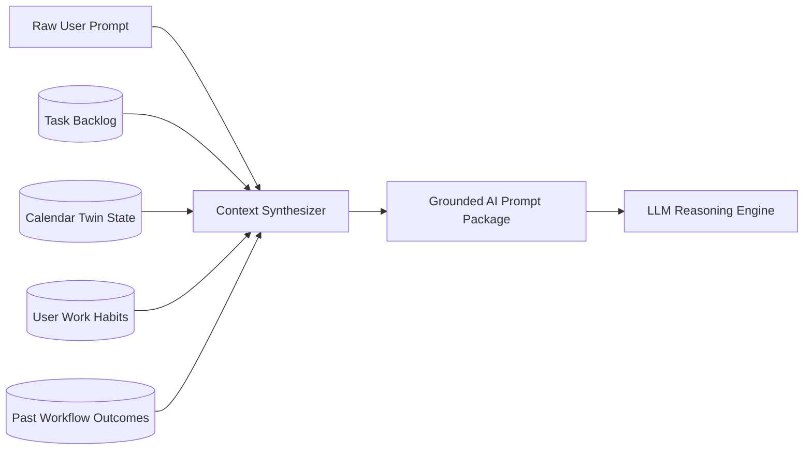

# Context Management & Memory Synthesis

## 1. The Context Synthesis Problem
Stateless chatbots treat every prompt in isolation. OPHELIA compounds context by retrieving state from PostgreSQL before passing prompts to the reasoning model:

### Contextual Inputs:
1. **Active Schedule Twin:** Current week's confirmed meetings and open focus blocks.
2. **Deadline Registry:** Pending assignments, exams, and priority scores.
3. **User Work Habits:** Daily maximum focus limits, preferred deep-work hours, rest intervals.
4. **Approval History:** Historical patterns of which suggestions the user accepted or modified.
