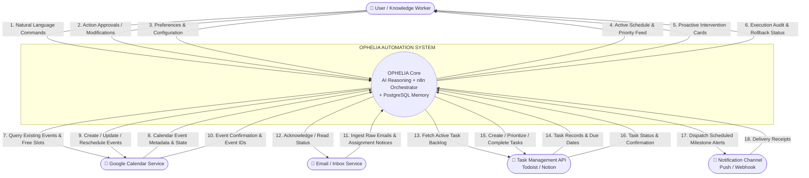

# Data Flow Diagram (DFD) — Level 0: Context Level

## 1. Overview
The **Level 0 Context Diagram** defines the external boundary of the **OPHELIA Automation System**, highlighting all external entities that interact with OPHELIA and the major data flows exchanged between them.

---

## 2. Mermaid Level 0 Diagram

---

## 3. External Entities & Data Flow Catalog

| Entity | Direction | Data Flow Name | Description |
| :--- | :--- | :--- | :--- |
| **User** | Inbound | `Natural Language Commands` | High-level instructions (e.g., *"Organize my week around my exam"*). |
| **User** | Inbound | `Action Approvals` | 1-click confirmation or dismissal of proposed schedule shifts. |
| **User** | Outbound | `Proactive Intervention Cards` | Contextual recommendations surfaced on the Command Center UI. |
| **Google Calendar** | Inbound | `Event Metadata & Free Slots` | Real-time state of existing meetings, classes, and appointments. |
| **Google Calendar** | Outbound | `Create / Reschedule Events` | API calls to insert optimized study blocks or move conflicting focus sessions. |
| **Email Service** | Inbound | `Assignment Notices` | Incoming syllabus updates, project announcements, and meeting invitations. |
| **Task Management API** | Inbound | `Task Records` | Existing task backlog items and their status. |
| **Task Management API** | Outbound | `Create / Update Tasks` | Synchronized task milestones decomposed from user goals. |
| **Notification Channel** | Outbound | `Scheduled Milestone Alerts`| Time-sensitive push webhooks armed 24h/4h prior to deadlines. |
