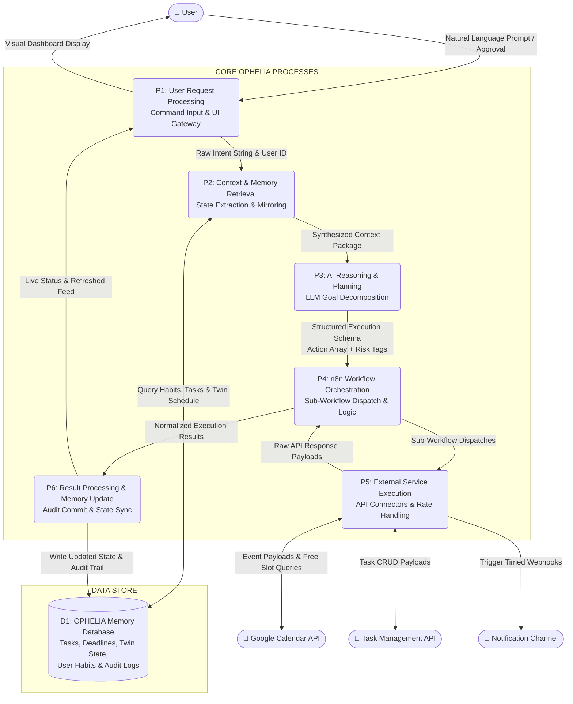

# Data Flow Diagram (DFD) — Level 1: Process Decomposition

## 1. Overview
The **Level 1 Data Flow Diagram** decomposes the OPHELIA system boundary into six discrete, interacting processes (**P1 through P6**) and one centralized persistent data store (**D1 — OPHELIA Memory Database**).

---

## 2. Mermaid Level 1 Diagram

---

## 3. Detailed Process Specifications

### P1: User Request Processing
* **Inputs:** Natural language command strings, UI approval clicks, configuration changes.
* **Outputs:** Validated user request objects, real-time status updates pushed to the Command Center UI.
* **Function:** Ingests user input from the dashboard, verifies authentication tokens, determines request type (immediate command vs. approval response), and forwards payload to context retrieval.

### P2: Context & Memory Retrieval
* **Inputs:** Raw intent string and user identifier from P1.
* **Outputs:** Synthesized multi-source context package (active schedule, deadline registry, stored habits).
* **Function:** Queries Data Store D1 for the user's active calendar twin state, current task priorities, and historical preferences. Assembles this into a unified context payload for the reasoning engine.

### P3: AI Reasoning & Planning (The Brain)
* **Inputs:** Synthesized context package from P2.
* **Outputs:** Deterministic execution plan formatted as a typed JSON schema.
* **Function:** Uses the LLM to extract entities, analyze schedule density, resolve time conflicts, allocate spaced work blocks, and tag each proposed action as either *Low-Risk Autonomous* or *High-Impact Approval-Required*.

### P4: n8n Workflow Orchestration (The Backbone)
* **Inputs:** Structured execution schema from P3.
* **Outputs:** Atomic sub-workflow invocations, validated execution results.
* **Function:** Evaluates the action array in n8n. If an action requires approval, pauses workflow execution and routes an alert to P1. For approved actions, manages execution order, evaluates conditional branches, and coordinates retry logic.

### P5: External Service Execution (The Tools)
* **Inputs:** Sub-workflow action dispatches from P4.
* **Outputs:** API response status codes, event IDs, error payloads.
* **Function:** Handles HTTP REST integration with Google Calendar, Todoist, Gmail, and notification webhooks. Manages OAuth tokens, respects rate limits, and returns normalized response payloads to P4.

### P6: Result Processing & Memory Update
* **Inputs:** Normalized execution results from P4.
* **Outputs:** Committed database updates in D1, real-time WebSocket push to P1.
* **Function:** Commits new calendar event IDs, updated task states, and audit log entries to PostgreSQL Data Store D1. Signals P1 to update the Command Center UI instantly.

---

## 4. Data Store D1: OPHELIA Memory Database
* **Entities Stored:**
  1. `users` & `user_preferences`: Working hours, daily maximum focus hours, rest intervals.
  2. `tasks`: Active assignments, exam dates, priority scores, completion status.
  3. `calendar_events_twin`: Synchronized local mirror of external calendar events for zero-latency conflict detection.
  4. `workflow_history`: Immutable log containing timestamp, original prompt, LLM reasoning trace, n8n execution status, and rollback tokens.
