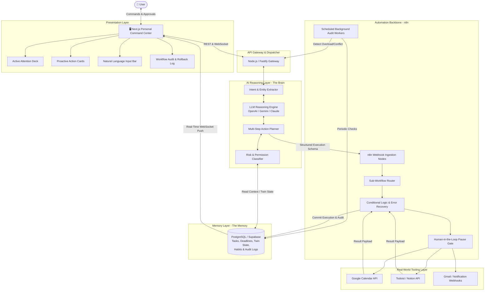

# System Architecture: End-to-End Technical Specification

This document details the layered technical architecture of **OPHELIA**, demonstrating how the AI reasoning layer, the n8n orchestration engine, the PostgreSQL memory layer, and the visual command center interact.

---

## 1. High-Level Architectural Diagram

---

## 2. Detailed Layer Specifications

### Layer 1: User Interface (AI Personal Command Center)
* **Framework:** React / Next.js with Tailwind CSS.
* **Key Components:**
  * **Today's Overview:** Visual timeline of meetings, deadlines, and allocated deep-work sessions.
  * **Priority Deck:** Dynamic stack of active tasks ranked by urgency and cognitive load.
  * **Proactive Recommendation Deck:** Cards generated by background workflows requiring user verification.
  * **Command Box:** High-level natural-language prompt input with auto-suggest.
  * **Audit Feed:** Live activity log showing the timestamp, trigger, and outcome of every n8n execution.

### Layer 2: AI Intelligence Layer (The Brain)
* **Responsibilities:**
  * **Intent Understanding:** Converts unstructured conversational input into typed operational goals.
  * **Entity & Constraint Mining:** Extracts assignment deadlines, exam dates, priority tags, and duration estimates.
  * **Contextual Grounding:** Queries the database for existing calendar commitments, energy preferences (e.g., morning focus vs. evening focus), and historical habits.
  * **Deterministic Decomposition:** Transforms high-level goals into ordered arrays of atomic tool calls adhering to a strict JSON schema.
  * **Risk Classification:** Evaluates whether the plan requires user approval before dispatch.

### Layer 3: Automation Backbone (n8n Workflow Engine)
* **Core Role:** Industrial orchestration engine connecting intelligence to real-world services.
* **Key Nodes & Workflows:**
  * **Webhook Ingestion:** Validates incoming JSON action schemas from the AI layer.
  * **Dynamic Router (Switch Node):** Dispatches sub-workflows based on action types (`calendar.create`, `task.prioritize`, `alert.schedule`).
  * **Conditional Branching:** Evaluates API responses (e.g., if Google Calendar returns a 409 conflict, invokes reschedule logic).
  * **Human-in-the-Loop Gate:** Pauses execution of consequential actions until an approval webhook is received from the dashboard.
  * **Scheduled Cron Nodes:** Runs every 30 minutes to audit calendar load and upcoming deadlines.

### Layer 4: Memory Layer (PostgreSQL / Supabase)
* **Role:** Persistent ground truth preventing LLM amnesia.
* **Tables:**
  * `users` & `user_preferences`: Work hours, focus duration limits, energy patterns.
  * `tasks`: Backlog items, deadlines, priority scores, completion status.
  * `calendar_events_twin`: Cached mirror of Google Calendar events to compute conflict graphs locally.
  * `workflow_history`: Complete audit trail of executed workflows, input schemas, and rollback tokens.

### Layer 5: External Services (Real-World Tools)
* **Google Calendar API:** Event creation, schedule queries, and meeting adjustments.
* **Todoist / Notion API:** Task creation, subtask checklist management, and priority tagging.
* **Push Notification Service / SendGrid:** Timed reminders, SMS/Email alerts for upcoming milestones.
