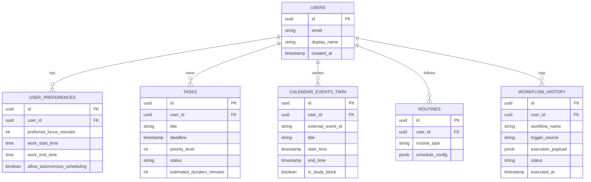

# Database Schema Specification (PostgreSQL / Supabase)

> **Status:** Conceptual Schema Specification (To be provisioned during prototype phase)



---

## SQL Schema Definitions

```sql
-- Core Users Table
CREATE TABLE users (
    id UUID PRIMARY KEY DEFAULT gen_random_uuid(),
    email VARCHAR(255) UNIQUE NOT NULL,
    display_name VARCHAR(100) NOT NULL,
    created_at TIMESTAMP WITH TIME ZONE DEFAULT CURRENT_TIMESTAMP
);

-- User Preferences & Habits Table
CREATE TABLE user_preferences (
    id UUID PRIMARY KEY DEFAULT gen_random_uuid(),
    user_id UUID REFERENCES users(id) ON DELETE CASCADE,
    preferred_focus_minutes INT DEFAULT 90,
    work_start_time TIME DEFAULT '09:00:00',
    work_end_time TIME DEFAULT '19:00:00',
    allow_autonomous_scheduling BOOLEAN DEFAULT TRUE
);

-- Tasks Registry Table
CREATE TABLE tasks (
    id UUID PRIMARY KEY DEFAULT gen_random_uuid(),
    user_id UUID REFERENCES users(id) ON DELETE CASCADE,
    title VARCHAR(255) NOT NULL,
    deadline TIMESTAMP WITH TIME ZONE NOT NULL,
    priority_level INT DEFAULT 2, -- 1: Critical, 2: High, 3: Medium, 4: Low
    status VARCHAR(50) DEFAULT 'PENDING',
    estimated_duration_minutes INT DEFAULT 60,
    created_at TIMESTAMP WITH TIME ZONE DEFAULT CURRENT_TIMESTAMP
);

-- Calendar Twin State Cache
CREATE TABLE calendar_events_twin (
    id UUID PRIMARY KEY DEFAULT gen_random_uuid(),
    user_id UUID REFERENCES users(id) ON DELETE CASCADE,
    external_event_id VARCHAR(255) NOT NULL,
    title VARCHAR(255) NOT NULL,
    start_time TIMESTAMP WITH TIME ZONE NOT NULL,
    end_time TIMESTAMP WITH TIME ZONE NOT NULL,
    is_study_block BOOLEAN DEFAULT FALSE,
    updated_at TIMESTAMP WITH TIME ZONE DEFAULT CURRENT_TIMESTAMP
);

-- Workflow Execution Audit Trail
CREATE TABLE workflow_history (
    id UUID PRIMARY KEY DEFAULT gen_random_uuid(),
    user_id UUID REFERENCES users(id) ON DELETE CASCADE,
    workflow_name VARCHAR(100) NOT NULL,
    trigger_source VARCHAR(50) NOT NULL, -- COMMAND_LINE, PROACTIVE_CRON, WEBHOOK
    execution_payload JSONB NOT NULL,
    status VARCHAR(50) NOT NULL, -- SUCCESS, FAILED, AWAITING_APPROVAL, ROLLED_BACK
    executed_at TIMESTAMP WITH TIME ZONE DEFAULT CURRENT_TIMESTAMP
);
```
