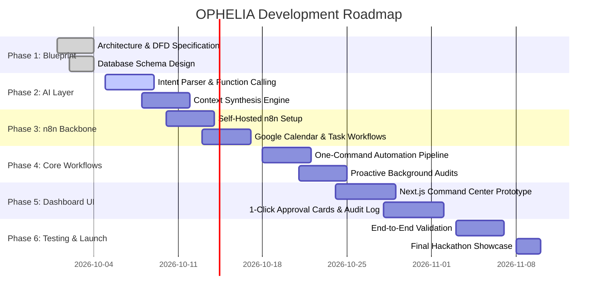

# Implementation Roadmap: From Blueprint to Prototype

This phased development roadmap outlines the technical progression of OPHELIA. Unfinished phases are explicitly scheduled rather than claimed.

---

## Milestone Breakdown

### Phase 1: Foundations & Technical Blueprint (Current)
* [x] Problem statement and contextual automation scope defined.
* [x] End-to-end layered architecture specified.
* [x] Level 0 and Level 1 Data Flow Diagrams (DFDs) drafted.
* [x] Relational schema designed for PostgreSQL / Supabase.
* [x] n8n workflow patterns and payload schemas formalized.

### Phase 2: AI Reasoning Layer
* [ ] Implement intent extraction and structured entity parser.
* [ ] Integrate function calling with strict JSON schema validation.
* [ ] Build contextual prompt synthesizers querying local state.

### Phase 3: n8n Automation Engine Setup
* [ ] Deploy local/cloud n8n instance.
* [ ] Configure OAuth 2.0 connectors for Google Calendar and Todoist.
* [ ] Implement error handling and idempotent webhook endpoints.

### Phase 4: Core Automated Workflows
* [ ] Construct the One-Command Exam & Assignment Organizer workflow.
* [ ] Build the Morning Conflict Detection proactive cron job.
* [ ] Implement human-in-the-loop pause nodes.

### Phase 5: Personal Command Center Dashboard
* [ ] Scaffold Next.js / Tailwind command center UI.
* [ ] Implement Active Attention Deck and priority feeds.
* [ ] Build interactive Proactive Recommendation Cards with approval buttons.

### Phase 6: Integration, Testing & Security Audit
* [ ] Run end-to-end multi-service test traces.
* [ ] Verify rollback token handling in `workflow_history`.
* [ ] Document benchmark latency metrics.

### Phase 7: Deployment & Future Scope
* [ ] Deploy frontend on Vercel and backend/database on Supabase.
* [ ] Begin Phase 2 roadmap: Canvas LMS integration, mobile widgets, and speech interaction.
