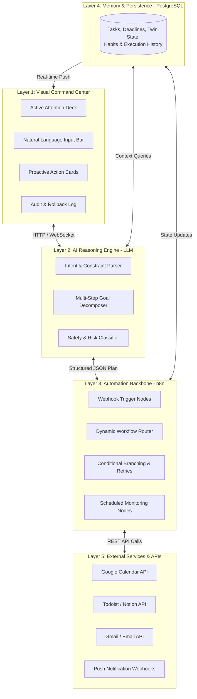

# Solution Overview: OPHELIA Personal Command Center

## 1. Vision & Core Philosophy

**OPHELIA (Optimized Personal Helper for Execution, Logistics & Intelligent Automation)** is designed to transform personal productivity from a passive, manual chore into an autonomous, proactive partnership.

### What OPHELIA Is:
* An **AI Personal Command Center** providing total situational visibility over tasks, calendar commitments, and deadlines.
* An **Autonomous Orchestrator** powered by n8n that turns single high-level commands into dozens of atomic API executions.
* A **Proactive Assistant** that monitors connected services in the background and surfaces intervention plans before conflicts become crises.

### What OPHELIA Is NOT:
* **NOT a generic chatbot:** Conversational chatbots merely output paragraphs of text suggestions. The user is still forced to spend 25 minutes opening Google Calendar and creating tasks manually. OPHELIA actually performs the work.
* **NOT a voice assistant:** Voice interaction introduces ambient transcription errors and privacy concerns. OPHELIA is designed as a visual, high-density dashboard with concise natural language command inputs.
* **NOT an unconstrained rogue agent:** OPHELIA enforces strict human-in-the-loop approval gates for consequential actions, ensuring the user remains in absolute control.

---

## 2. Chatbot vs. AI Automation Command Center

| Dimension | Standard Conversational Chatbot | OPHELIA AI Command Center |
| :--- | :--- | :--- |
| **Primary Interface** | Ephemeral, linear chat window | Structured dashboard (priorities, calendar, audit log) |
| **Output Type** | Text advice & markdown suggestions | Real-world API execution (Calendar events, tasks, alerts) |
| **Execution Layer** | None (User does the manual work) | **n8n industrial workflow automation engine** |
| **Context Retention**| Stateless or limited to current chat | **Persistent PostgreSQL memory** (tasks, habits, twin state) |
| **Operational Stance**| Completely passive (waits for prompt) | **Proactive** (monitors background data and alerts early) |
| **Safety Governance**| None | Strict dual-tier permissions with 1-click approval gates |

---

## 3. The Five Interlocking Architectural Layers

1. **Dashboard (Interface):** The single pane of glass showing what needs attention right now, what is scheduled, and what actions OPHELIA recommends.
2. **AI Layer (The Brain):** The LLM receives user commands or proactive alerts, extracts entities, consults stored context, and constructs a deterministic JSON execution schema.
3. **n8n Engine (Execution Backbone):** Ingests the JSON schema from the LLM, validates it, and triggers atomic sub-workflows across connected APIs with built-in retry handling and error recovery.
4. **PostgreSQL (Memory):** Holds persistent records of active tasks, deadlines, user routines, calendar twin state, and execution history.
5. **External Services (Tools):** Real-world productivity tools including Google Calendar, task managers, and notification channels.

---

## 4. Human-in-the-Loop Safety Model

OPHELIA establishes trust through a transparent, dual-tier governance system:
* **Low-Risk Autonomous Actions:** Tasks such as setting a reminder, inserting a non-conflicting study block, or drafting a checklist are executed immediately.
* **High-Impact Approval Actions:** Rescheduling existing meetings, sending external communications, or modifying sensitive records generate a **Proactive Recommendation Card** with clear `[Review Details]` and `[⚡ Execute Action]` controls.
* **Full Auditability:** Every single action executed by n8n is logged in the PostgreSQL audit trail with an instant 1-click rollback option.
