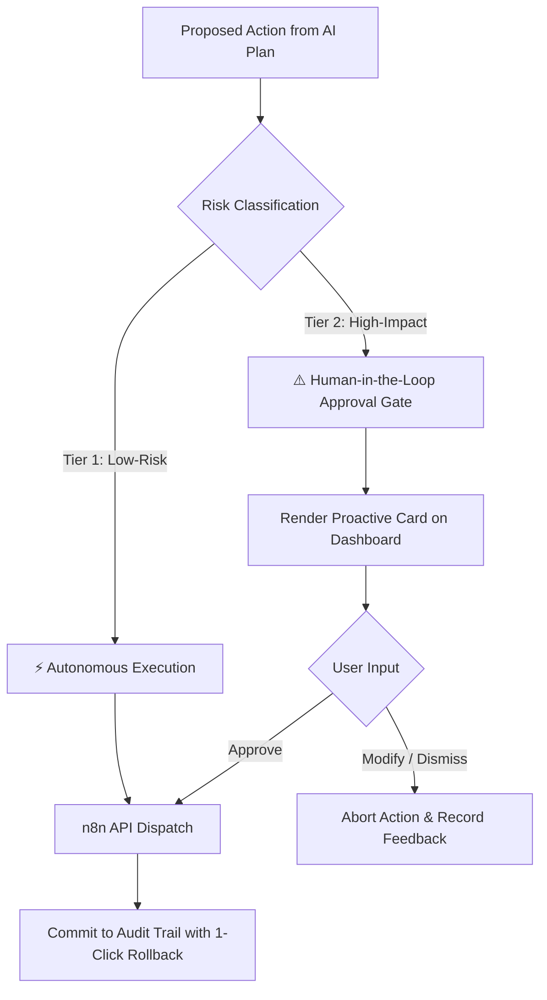

# User Control, Governance & Safety Architecture

## 1. The Dual-Tier Permission Model

OPHELIA establishes strict safety boundaries to ensure the AI never acts as a rogue agent:

### Tier 1: Low-Risk Autonomous Actions
* Creating personal reminder notifications.
* Inserting non-conflicting study blocks into open calendar slots.
* Drafting subtask checklists in Todoist.
* Organizing unstructured assignment notes.

### Tier 2: High-Impact Approval-Required Actions
* Rescheduling or shifting existing meetings involving other attendees.
* Overwriting or deleting existing calendar entries.
* Sending external communications or email updates.
* Modifying sensitive account configuration settings.

---

## 2. Transparent Audit Log & Rollback
* Every action records an immutable row in the `workflow_history` table:
  * `id`: Unique workflow run identifier.
  * `trigger_source`: What initiated the action (`USER_COMMAND` or `PROACTIVE_CRON`).
  * `reasoning_trace`: The specific rationale generated by the LLM.
  * `execution_payload`: The exact parameters passed to external APIs.
  * `rollback_token`: Reversible API payload allowing the user to click `[Undo Action]` at any time.
