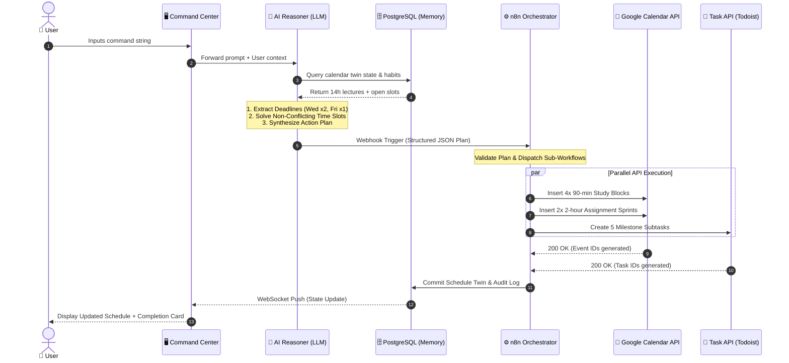

# Flagship Workflow: One-Command Automation

> **Status:** Planned Workflow Specification (To be implemented in n8n prototype phase)

## 1. Overview
The **One-Command Automation** workflow represents OPHELIA's primary differentiator. Instead of requiring the user to manually configure tasks, inspect calendars, and set alarms across multiple applications, OPHELIA takes a single unstructured sentence and executes all required actions autonomously.

---

## 2. Concrete Real-World Example

### User Input:
> *“I have two assignments due Wednesday and an exam on Friday. Organize my week around my existing schedule.”*



---

## 3. Step-by-Step Execution Lifecycle

### Step 1: Ingestion & Intent Classification
* The Command Center UI forwards the prompt string to the backend API.
* The AI layer classifies the primary intent as `intent: "SCHEDULE_OPTIMIZATION"` with domain `academic`.

### Step 2: Entity & Deadline Extraction
* The LLM extracts the structured parameters:
  * `Assignment_1`: Due Wednesday 23:59 (Weight: High)
  * `Assignment_2`: Due Wednesday 23:59 (Weight: High)
  * `Exam_1`: Scheduled Friday 09:00 (Weight: Critical)

### Step 3: Context & Calendar Synchronization
* OPHELIA queries PostgreSQL for the user’s cached schedule twin:
  * Monday: 4 hours of lectures (10:00–12:00, 14:00–16:00).
  * Tuesday: 3 hours of lab (13:00–16:00).
  * Wednesday: Open morning; lecture (15:00–17:00).
  * Thursday: Open morning and afternoon.
* Evaluates user preferences: Max 3 hours continuous study, preferred morning focus window.

### Step 4: Multi-Step Goal Planning
* The reasoning engine synthesizes an optimal study distribution:
  1. *Monday 16:30–18:30:* Assignment #1 Sprint (2 hours).
  2. *Tuesday 09:30–11:00:* Exam Prep Block #1 (90 mins).
  3. *Tuesday 16:30–18:30:* Assignment #2 Sprint (2 hours).
  4. *Wednesday 09:30–11:00:* Exam Prep Block #2 (90 mins).
  5. *Wednesday 11:30–13:00:* Final Review & Assignment Submission Buffer.
  6. *Thursday 09:30–11:30:* Exam Prep Deep Dive Block #3 (2 hours).
  7. *Thursday 15:00–17:00:* Exam Prep Final Review Block #4 (2 hours).

### Step 5: JSON Schema Dispatch to n8n
* The LLM emits a strictly formatted JSON payload targeting the n8n webhook:
```json
{
  "workflow": "academic_week_organizer",
  "actions": [
    {
      "service": "google_calendar",
      "action": "create_event",
      "params": {
        "title": "📚 Exam Prep — Deep Focus Block 1",
        "start": "2026-10-06T09:30:00Z",
        "end": "2026-10-06T11:00:00Z"
      }
    },
    {
      "service": "todoist",
      "action": "create_task",
      "params": {
        "title": "Submit Assignment 1 via Portal",
        "due": "2026-10-07T23:59:00Z",
        "priority": 1
      }
    }
  ]
}
```

### Step 6: Multi-Service n8n Execution
* The n8n engine executes the sub-workflows:
  * Calls Google Calendar API across 6 distinct event creation requests.
  * Calls Todoist API to create milestone tasks with assigned due dates.
  * Configures scheduled cron triggers to send push reminders 24 hours and 4 hours before submission.

### Step 7: Memory Commit & State Reflection
* All generated event IDs and task IDs are committed to the PostgreSQL `tasks` and `calendar_events_twin` tables.
* A success summary card is rendered on the AI Command Center:
  > *“Your week has been organized: 4 Exam Prep sessions and 2 Assignment blocks scheduled without conflicts.”*
