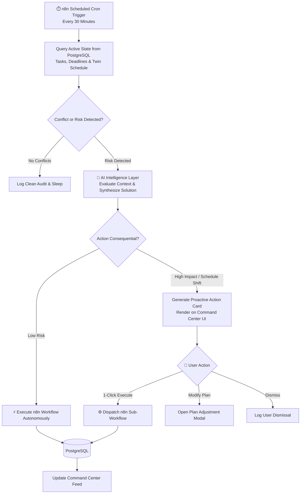

# Proactive Assistant Workflow: Background Monitoring

> **Status:** Planned Workflow Specification (To be implemented in n8n prototype phase)

## 1. Overview
Unlike standard reactive bots that require continuous human prompting, OPHELIA executes background scheduled jobs to detect potential bottlenecks and conflicts before they cause missed deadlines.

---

## 2. Background Monitoring Architecture



---

## 3. Detected Conflict Triggers

1. **Approaching Deadline without Dedicated Work Time:**
   * An assignment is due in 24 hours, but the calendar contains zero allocated study blocks.
2. **Direct Meeting Overlap:**
   * A teammate schedules a sync at 15:00 that collides with a planned 90-minute focus session.
3. **Overloaded Focus Load (Burnout Risk):**
   * Total scheduled commitments on Tuesday exceed 8.5 hours.
4. **Routine & Habit Drift:**
   * User has consistently completed morning planning before 09:00, but has missed two consecutive days.

---

## 4. Concrete Proactive Intervention Card Example

When a conflict is detected at 08:30 AM, OPHELIA renders the following structured card on the dashboard:

```text
┌────────────────────────────────────────────────────────────────────────┐
│ ⚠️ AI COMMAND CENTER • PROACTIVE INTERVENTION CARD                      │
├────────────────────────────────────────────────────────────────────────┤
│ Good morning, Punya.                                                   │
│ OPHELIA analyzed your day and detected a schedule conflict:            │
│ • You have 4 active tasks scheduled for today.                         │
│ • Schedule Conflict: Your 3:00 PM team sync overlaps with planned       │
│   assignment work.                                                     │
│ • Urgent Deadline: Assignment #2 is due tomorrow at 11:59 PM.          │
│                                                                        │
│ [SUGGESTED ACTION PLAN]                                                │
│ Shift today's study session to 7:00 PM and insert a 90-minute          │
│ focused work block at 4:30 PM.                                         │
│                                                                        │
│   [ Review Plan Details ]         [ ⚡ Execute Action via n8n ]        │
└────────────────────────────────────────────────────────────────────────┘
```

---

## 5. Engineering Boundaries & Guardrails
* **Connected Data Only:** OPHELIA monitors strictly the services connected via authorized API tokens (Calendar, Tasks, Email notices). It does not monitor external or offline activity.
* **No Unilateral Calendar Sabotage:** OPHELIA never cancels or reschedules existing client or team meetings without explicit one-click approval.
* **Alert Throttling:** Background audits limit proactive cards to a maximum of 3 notifications per day to prevent alert fatigue.
